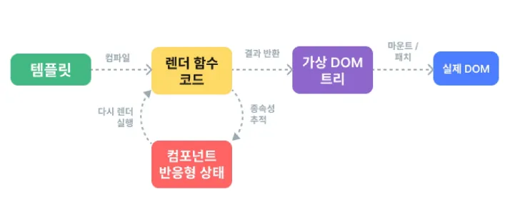

# SFC (Sing-File Component)

※ 사전 작업 : 런타임 구성을 위한 node 설치 필요

### Single-File Components

- Component
    - 재사용 가능한 코드 블록
- Single-File Components
    - 컴포넌트의 템플릿, 로직 밑 스타일을 하나의 파일로 묶어낸 특수한  파일 형식 (***.vue** 파일)
        
        ※ 기본적인 style, 태그, js는 동일하게 사용 됨
        
        ※ 단, 데이터들 (이미지, 태그 내 텍스트 등)은 달라지기 때문에 상태를 관리해줘야 함
        
- SFC 구성요소
    - 세 가지 유형의 최상위 언어 블록으로 구성
        - template, script, style
    - 언어 블록 작성 순서 추천
        - template → script → style
- script setup 블록
    - 이 전에 app instance 안에 작성하는 setup 대신에 이제는
        
        <script setup> 형식으로 사용
        
- style sciped 블록
    - <style scoped> 블록 내의 style은 현재 컴포넌트에만 적용 됨
- 컴포넌트 사용하기
    - [play.vue.org](http://play.vue.org) 가면 코드 작성 및미리보기 가능
    
    ⇒ 실체 프로젝트에서는 Vie와 같은 공식 빌드(build) 도구를 사용
    

### Vite (SFC build tool)

- vite
    - 프론트 엔드 개발 도구
        
        ⇒ 빠르 개발 환겨을 위한 빌드 도구와 개발 서버를 제공
        
        https://vitejs.dev
        
- build
    - 프로젝트 소스 코드를 최적화, 번들링하여 배포할 수 있는 형식으로 변환
    - 개발 중에 사용되는 여러 소스 파일 및 리소스를 최적화된 형태로 조합하여 최종 소프트웨어 제품 생성
    
    ⇒ Vite는 이러한 빌드 프로세스를 수행하는 데 사용되는 도구
    
- Vue project 생성
    1. 사전 작업 : npm create vue@latest
    2. 프로젝트 명 설정
    3. 프로젝트에 추가 할 설정 선택
    4. 프로젝트 생성 완료
    5. 안내하는 세가지 동작 (cd 프로젝트 & npm install & npm run dev)

### Node Package Managet (NPM)

- Node.js의 기본 패키지 관리자
- Node.js
    - Chrome의 V8 JavaScript 엔진을 기반으로 하는 Server-Side 실행 환경
- Node.js의 영향
    - 기존에 브라우저 안에서만 동작할 수 있었던 JavaScript를 브라우저가 아닌 서버 측에서도 실행할 수 있게 함
        
        ⇒ 프론트엔드와 백엔드에서 동일한 언어로 개발할 수 있게 됨
        
    - NPM을 활용해 수많은 오픈 소스 패키지와 라이브러리를 제공하여 개발자들이 손쉽게 코드를 공유하고 재사용할 수 있게 함

### 모듈과 번들러

- Module
    - 프로그램을 구성하는 독립적인 코드 블록 (*.js 파일)
    - why Module?
        - 개발하는 애플리케이션의 크기가 커지고 복잡해지면서 파일 하나에 모든 기능 담기 어려워 짐
        - 따라서 자연스럽게 파일을 여러 개로 분리하여 관리 → 이 파일이 모듈
- Module의 한계
    - 어플리케이션 발전 → JavaScript 모듈 개수 증가
    - 병목 현상 및 의존성(연결성)이 깊어짐, 문제가 어떤 모듈 간의 문제인지 파악하기 어려워 짐
    - 복잡하고 깊은 모듈 간 의존성 문제를 해결하기 위한 도구
        
        ⇒ Bundler
        
- Bundler
    - 여러 모듈과 파일을 하나(혹은 여러 개)의 번들로 묶어 최적화하여 애플리케이션에서 사용할 수 있게 만들어주는 도구
    - why Bundler?
        - 의존성 관리, 코드 최적화, 리소스 관리 등
        - Bundler가 하는 작업들 Bundling이라 함

### Vue Project 구조

- 기본 구조
    - public 디렉토리
        - 정적 파일 위치
            - 소스코드에서 참조되지 않는
            - 항상 이름이 같은
            - import 할 필요 없는
        - 항상 root 절대 경로를 사용하여 참조
            
            ※ pulice 디렉토리 안에 assets 디렉토리 쓰기
            
    - src 디렉토리
        - 프로젝트의 주요 소스 코드를 포함
        - 실제로 우리가 작업하게 될 대부분의 소스 코드가 위치
        - 컴포넌트, 스타일, 라우팅 등 프로젝트 핵심 코드를 관리
        - src/assets
            - 컴포넌트 자체에서 사용할 정적 자원
            - 컴포넌트가 아닌 곳에서는 public 디렉토리에 위치한 파일을 사용
        - src/components
            - 실제로 페이지에 사용하게 될 개별 Vue 컴포넌트들이 위치
        - src/App.vue
            - Vue 앱의 Root 컴포넌트
            - 다른 하위 컴포넌트들을 포함
            - 애플리케이션 전체의 레이아웃과 공통적인 요소를 정의
        - src/main.js
            - Vue 애플리케이션을 초기화하고, App.vue를 OM에 마운트하는 시작점
            - 필요한 라이브러리를 import 하고 전역 설정을 수행
        - index.html
            - Vue 앱의 기본 HTMl 파일

### 패키지 관리

- 프로젝트에 관란 기본 정보와 패키지 의존성을 정의하는 “설계도” 파일 (메타데이터 파일)
- package.json
    - 프로젝트에 관한 기본 정보와 패키지 의존성을 정의하는 ‘설계도’ 파일
    - why package.json
        - 프로젝트가 어떤 패키지를 사용하고, 어떤 스크립트를 실행할 수 있는지 명시
        - npm install 시 이를 참조하여 패키지를 설치
            - 어떤 패키지를 설치해야하는지
        
        ※프로젝트마다 가상환경 필요없이 node_modules가 관리해줄 것
        
- package-lock.json
    - 정확한 버전 정보 기록
    - 특징)
        - 정확한 버전 고정
        - 빌드 안정성 보장
        - 자동 관리
    - 프로젝트 구성원 간 동일한 패키지 재현
- node_modules
    - package.json과 package-lock.json에 따라 실제로 설치된 모들 패키지 저장
    - 역할)
        - 프로젝트 실행 시 필요한 모든 라이브러리와 코드 파일을 보관
        - 애플리케이션 구동 시 참조되는 실제 데이터 저장소
    - 특징)
        - npm install을 통해 설치된 모든 패키지들이 실제로 저장
        - 개발 시 직접 수정할 필요 없음

| package.json | 설계도 |
| --- | --- |
| package-lock.json | 상세 내역서 |
| node_modules | 자재 창고 |

## Vue Componenet 활용

- 컴포넌트 사용 2단계
    1. 컴포넌트 파일 생성
    2. 컴포넌트 등록 (import)

※ 사전 준비 : App.vue 초기화

- 모든 컴포넌트 삭제
- vue
- lang=”scss” 지우기
- components 안의 안쓸 컴포넌트 모두 삭제
- assets도 삭제
    - main.js에서 assets 경로로 import 하는 라인 제거

### 컴포넌트 파일 생성

1. MyComponent.vue 생성
2. 컴포넌트 등록 (import “**component”** form **경로**)
    
    ※ 경로에서 . → @로 표현
    
    ⇒ App(부모) = MyComponenet(자식) 관계 형성
    
- 재사용성 확인하기
    - 등록한 컴포넌트 재사용
    
    ```jsx
    <template>
      <h1>App.vue</h1>
      <MyComponent />
      <MyComponent />
      <MyComponent />
      <MyComponent />
    </template>
    ```
    

### Virtual DOM

- 가상의 DOm을 메모리에 저장하고 실제 DOM과 동기화하는 프로그래밍 개념
- 실제 DOM과의 변경 사항 비교를 통해 변경된 부분만 실제 DOM에 적용하는 방식
- 웹 애플리케이션의 성능을 향상시키기 위한 Vue의 내부 렌더링 기술
- 내부 렌더링 과정
    
    
    
- why Virtual DOM?
    - 효율성
        - DOM 조작 최소화 ⇒ 변경된 부분만 업데이트
    - 반응성
        - 데이터 변경 감지 → UI 자동 업데이트
    - 추상화
- 주의사항
    - 실제 DOM에 직접 접근하지 말것
        - querSelector, createElement 등 .. 상ㅇ 금지
    
    ⇒ ref()와 Lifecycle Hooks 함수를 사용해 간접적으로 접근하여 조작할 것
    
- 그럼 언제 DOM 엘리먼트에 직접 접근할까?
    - ref 속성을 사용해서 특정 DOM 엘리먼트에 직접적인 참고를 얻을 수 있음
    
    ```jsx
    <input ref="input">
    
    <script setup>
    const input = ref(null)
    </script>
    ```
    

### Single Root Element

- 가독성, 스타일링, 명확한 컴포넌트 구조를 위해 각 컴포넌트에는 최상단 HTML 요소를 작성해야 함
    
    e.g. 컴포넌트 영역을 <div> 태그로 감싸기
    

### CSS Scoped

- scoped 속성
    - 현재 컴포넌트 내부 요소에만 적용되도록 범위 제한
- 부모 - 자식 관계에서의 스타일 전파
    - 일반적으로 scoped 스타일은 부모-자식 영향 안미침
    - 예외적으로 root element에는 스타일 영향 줌
    - 부모가 자식 컴포넌트를 레이아웃 할 때, 필요한 경우가 있기 때문# SFC (Sing-File Component)

※ 사전 작업 : 런타임 구성을 위한 node 설치 필요

### Single-File Components

- Component
    - 재사용 가능한 코드 블록
- Single-File Components
    - 컴포넌트의 템플릿, 로직 밑 스타일을 하나의 파일로 묶어낸 특수한  파일 형식 (***.vue** 파일)
        
        ※ 기본적인 style, 태그, js는 동일하게 사용 됨
        
        ※ 단, 데이터들 (이미지, 태그 내 텍스트 등)은 달라지기 때문에 상태를 관리해줘야 함
        
- SFC 구성요소
    - 세 가지 유형의 최상위 언어 블록으로 구성
        - template, script, style
    - 언어 블록 작성 순서 추천
        - template → script → style
- script setup 블록
    - 이 전에 app instance 안에 작성하는 setup 대신에 이제는
        
        <script setup> 형식으로 사용
        
- style sciped 블록
    - <style scoped> 블록 내의 style은 현재 컴포넌트에만 적용 됨
- 컴포넌트 사용하기
    - [play.vue.org](http://play.vue.org) 가면 코드 작성 및미리보기 가능
    
    ⇒ 실체 프로젝트에서는 Vie와 같은 공식 빌드(build) 도구를 사용
    

### Vite (SFC build tool)

- vite
    - 프론트 엔드 개발 도구
        
        ⇒ 빠르 개발 환겨을 위한 빌드 도구와 개발 서버를 제공
        
        https://vitejs.dev
        
- build
    - 프로젝트 소스 코드를 최적화, 번들링하여 배포할 수 있는 형식으로 변환
    - 개발 중에 사용되는 여러 소스 파일 및 리소스를 최적화된 형태로 조합하여 최종 소프트웨어 제품 생성
    
    ⇒ Vite는 이러한 빌드 프로세스를 수행하는 데 사용되는 도구
    
- Vue project 생성
    1. 사전 작업 : npm create vue@latest
    2. 프로젝트 명 설정
    3. 프로젝트에 추가 할 설정 선택
    4. 프로젝트 생성 완료
    5. 안내하는 세가지 동작 (cd 프로젝트 & npm install & npm run dev)

### Node Package Managet (NPM)

- Node.js의 기본 패키지 관리자
- Node.js
    - Chrome의 V8 JavaScript 엔진을 기반으로 하는 Server-Side 실행 환경
- Node.js의 영향
    - 기존에 브라우저 안에서만 동작할 수 있었던 JavaScript를 브라우저가 아닌 서버 측에서도 실행할 수 있게 함
        
        ⇒ 프론트엔드와 백엔드에서 동일한 언어로 개발할 수 있게 됨
        
    - NPM을 활용해 수많은 오픈 소스 패키지와 라이브러리를 제공하여 개발자들이 손쉽게 코드를 공유하고 재사용할 수 있게 함

### 모듈과 번들러

- Module
    - 프로그램을 구성하는 독립적인 코드 블록 (*.js 파일)
    - why Module?
        - 개발하는 애플리케이션의 크기가 커지고 복잡해지면서 파일 하나에 모든 기능 담기 어려워 짐
        - 따라서 자연스럽게 파일을 여러 개로 분리하여 관리 → 이 파일이 모듈
- Module의 한계
    - 어플리케이션 발전 → JavaScript 모듈 개수 증가
    - 병목 현상 및 의존성(연결성)이 깊어짐, 문제가 어떤 모듈 간의 문제인지 파악하기 어려워 짐
    - 복잡하고 깊은 모듈 간 의존성 문제를 해결하기 위한 도구
        
        ⇒ Bundler
        
- Bundler
    - 여러 모듈과 파일을 하나(혹은 여러 개)의 번들로 묶어 최적화하여 애플리케이션에서 사용할 수 있게 만들어주는 도구
    - why Bundler?
        - 의존성 관리, 코드 최적화, 리소스 관리 등
        - Bundler가 하는 작업들 Bundling이라 함

### Vue Project 구조

- 기본 구조
    - public 디렉토리
        - 정적 파일 위치
            - 소스코드에서 참조되지 않는
            - 항상 이름이 같은
            - import 할 필요 없는
        - 항상 root 절대 경로를 사용하여 참조
            
            ※ pulice 디렉토리 안에 assets 디렉토리 쓰기
            
    - src 디렉토리
        - 프로젝트의 주요 소스 코드를 포함
        - 실제로 우리가 작업하게 될 대부분의 소스 코드가 위치
        - 컴포넌트, 스타일, 라우팅 등 프로젝트 핵심 코드를 관리
        - src/assets
            - 컴포넌트 자체에서 사용할 정적 자원
            - 컴포넌트가 아닌 곳에서는 public 디렉토리에 위치한 파일을 사용
        - src/components
            - 실제로 페이지에 사용하게 될 개별 Vue 컴포넌트들이 위치
        - src/App.vue
            - Vue 앱의 Root 컴포넌트
            - 다른 하위 컴포넌트들을 포함
            - 애플리케이션 전체의 레이아웃과 공통적인 요소를 정의
        - src/main.js
            - Vue 애플리케이션을 초기화하고, App.vue를 OM에 마운트하는 시작점
            - 필요한 라이브러리를 import 하고 전역 설정을 수행
        - index.html
            - Vue 앱의 기본 HTMl 파일

### 패키지 관리

- 프로젝트에 관란 기본 정보와 패키지 의존성을 정의하는 “설계도” 파일 (메타데이터 파일)
- package.json
    - 프로젝트에 관한 기본 정보와 패키지 의존성을 정의하는 ‘설계도’ 파일
    - why package.json
        - 프로젝트가 어떤 패키지를 사용하고, 어떤 스크립트를 실행할 수 있는지 명시
        - npm install 시 이를 참조하여 패키지를 설치
            - 어떤 패키지를 설치해야하는지
        
        ※프로젝트마다 가상환경 필요없이 node_modules가 관리해줄 것
        
- package-lock.json
    - 정확한 버전 정보 기록
    - 특징)
        - 정확한 버전 고정
        - 빌드 안정성 보장
        - 자동 관리
    - 프로젝트 구성원 간 동일한 패키지 재현
- node_modules
    - package.json과 package-lock.json에 따라 실제로 설치된 모들 패키지 저장
    - 역할)
        - 프로젝트 실행 시 필요한 모든 라이브러리와 코드 파일을 보관
        - 애플리케이션 구동 시 참조되는 실제 데이터 저장소
    - 특징)
        - npm install을 통해 설치된 모든 패키지들이 실제로 저장
        - 개발 시 직접 수정할 필요 없음

| package.json | 설계도 |
| --- | --- |
| package-lock.json | 상세 내역서 |
| node_modules | 자재 창고 |

## Vue Componenet 활용

- 컴포넌트 사용 2단계
    1. 컴포넌트 파일 생성
    2. 컴포넌트 등록 (import)

※ 사전 준비 : App.vue 초기화

- 모든 컴포넌트 삭제
- vue
- lang=”scss” 지우기
- components 안의 안쓸 컴포넌트 모두 삭제
- assets도 삭제
    - main.js에서 assets 경로로 import 하는 라인 제거

### 컴포넌트 파일 생성

1. MyComponent.vue 생성
2. 컴포넌트 등록 (import “**component”** form **경로**)
    
    ※ 경로에서 . → @로 표현
    
    ⇒ App(부모) = MyComponenet(자식) 관계 형성
    
- 재사용성 확인하기
    - 등록한 컴포넌트 재사용
    
    ```jsx
    <template>
      <h1>App.vue</h1>
      <MyComponent />
      <MyComponent />
      <MyComponent />
      <MyComponent />
    </template>
    ```
    

### Virtual DOM

- 가상의 DOm을 메모리에 저장하고 실제 DOM과 동기화하는 프로그래밍 개념
- 실제 DOM과의 변경 사항 비교를 통해 변경된 부분만 실제 DOM에 적용하는 방식
- 웹 애플리케이션의 성능을 향상시키기 위한 Vue의 내부 렌더링 기술
- 내부 렌더링 과정
    
    
    
- why Virtual DOM?
    - 효율성
        - DOM 조작 최소화 ⇒ 변경된 부분만 업데이트
    - 반응성
        - 데이터 변경 감지 → UI 자동 업데이트
    - 추상화
- 주의사항
    - 실제 DOM에 직접 접근하지 말것
        - querSelector, createElement 등 .. 상ㅇ 금지
    
    ⇒ ref()와 Lifecycle Hooks 함수를 사용해 간접적으로 접근하여 조작할 것
    
- 그럼 언제 DOM 엘리먼트에 직접 접근할까?
    - ref 속성을 사용해서 특정 DOM 엘리먼트에 직접적인 참고를 얻을 수 있음
    
    ```jsx
    <input ref="input">
    
    <script setup>
    const input = ref(null)
    </script>
    ```
    

### Single Root Element

- 가독성, 스타일링, 명확한 컴포넌트 구조를 위해 각 컴포넌트에는 최상단 HTML 요소를 작성해야 함
    
    e.g. 컴포넌트 영역을 <div> 태그로 감싸기
    

### CSS Scoped

- scoped 속성
    - 현재 컴포넌트 내부 요소에만 적용되도록 범위 제한
- 부모 - 자식 관계에서의 스타일 전파
    - 일반적으로 scoped 스타일은 부모-자식 영향 안미침
    - 예외적으로 root element에는 스타일 영향 줌
    - 부모가 자식 컴포넌트를 레이아웃 할 때, 필요한 경우가 있기 때문