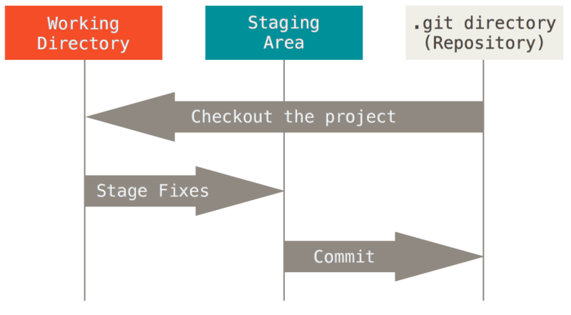
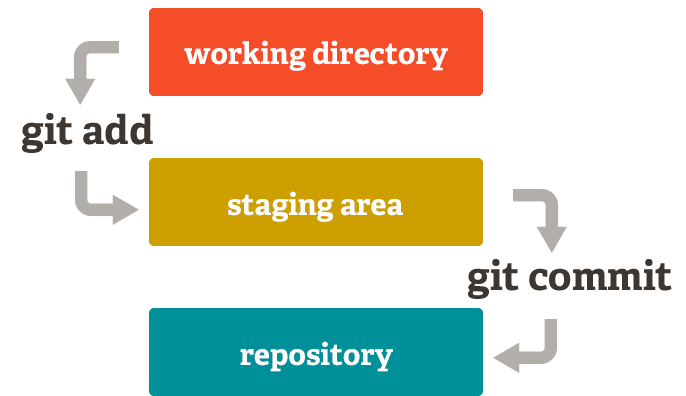
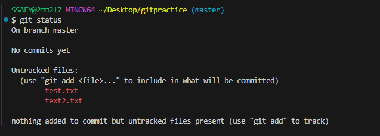
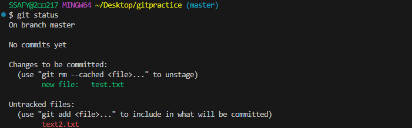
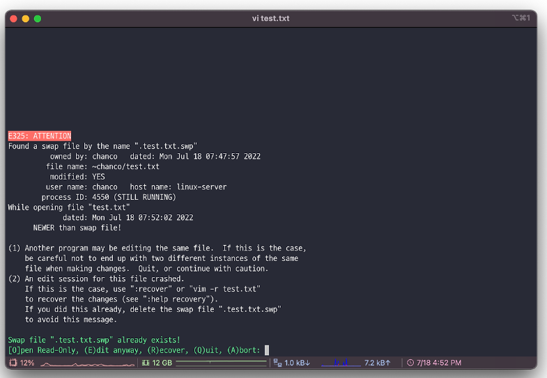

## 배운 내용
### git. 사용법
- 버전 관리 툴
    
    : 전체 내용이 아닌 변경 사항을 버전마다 표기
    
- 내 모든 버전이 변경 사항만 갖는다.

### 중앙 vs 분산

- 분산식
    
    : 버전을 여러 개의 복제된 서버에 보관
    

### git의 3가지 영역





1. Working Directory
2. Staging Area
    - 워킹 디렉토리에서 작업한 버전을 대기시키는 영역
3. Repository
    - 모든 버전과 변경 이력이 기록

- Commit = “version”

### 깃 사용하기

최초로 git status 했을 때



git add했을 시



- git init ⇒ 로컬 저장소 설정(초기화)
    - git의 버전 관리를 시작할 디렉토리에서 진행해야함
    - master>slave가 원래였는데, git에서는 main으로 표기됨
- git status ⇒ 깃 상태보기
    - gif config --global [alias.st](http://alias.st/) 'status' → git st로 명령어 바꾸기
- git add ⇒ WD에서 작업한 내용을 SA에 추가
    - git add -A ⇒ 모든 코드 add 시키기
- git commit ⇒ 레퍼지토리로 커밋하기
    - git commit -m “버전명”
- git config —global
    - [user.email](http://user.email) “메일”
    - [user.name](http://user.name) “이름”

- 파일명 변경 시
    
    → 업데이트 할 내용이 add/rm 두 개 생김 → 둘 다 처리해야하나?
    
    - 변경된 것만 처리해도 되고
        - 필요 시 restore로 복구
        - rm이나 add로 처리

---

### GIT 작업을 어디서 할지

GitLab ← 싸피에서

Github → 일반적으로

README : repository를 설정하는 것(없어도 됨)

Add.gitignore : 추적 안디도록 하는 

- 환경설정 코드 등

### 원격 ↔ 로컬 연결하기

- git remote add ⇒ 원격 추가
    - git remote add *origin remote_repo_url
        
        *origin : 일반적인 명칭
        
- git push/pull/clone
    - push → 로컬/원격에서 원격/로컬로 밀어넣기
    - pull → 땡겨오기
    - clone → 복사하기
        - git clone url (로컬에 github에 있는 repo.git 생성)
- gitignore
    - .gitignore 파일 생성 → 무시할 파일 입력
    - ignore 파일 목록 : git ignore(gitignore.io - 자신의 프로젝트에 꼭 맞는 .gitignore 파일을 만드세요

### Git commit 복구하기

- git revert ⇒ commit 결과 복구 및 복구 커밋 남김
    - git revert [commit id]
- git reset
    - git reset —soft [commit id] ⇒ 해당 커밋 시점으로 돌아가기
        
        다시 commit하면 원래대로 돌아오겠죠?
        
    - git reset —mixed [~] ⇒ 중간단계의 리셋
        
        staged 상태로 돌가감
        
    - git reset —hard [~] ⇒ 시점으로 돌아가 작업 내용 삭제
        
        git reflog하면 복구 가능 → reflog에 있는 작업을 다시 reset hard
        
- git restore  (**쓰지마세요. 개발에서는 삭제라는 개념은 위험하다.**)
    
    : 코드를 수정했을 때(e.g. return a+b함수를 추가하고 add하기 전, restore하면 사라짐)
    
    - staged 된 내용 수정 사항 날라감
- git stash (이거 쓰세요)
    
    : 임시저장
    
    - git stash를 하면 unstaged된 항목들을 WIP상태로 저장
    - git stash pop [number] ⇒ 복구

---

### 참고사항

- E325 에러 발생 시
```markdown
만약 git 작업하던도중 강제종료 당하거나 멈추었을때 강제로 나가게 되면 이렇게 기존의 작업 하던 commit이 남아 있어 처리해달라고 에러가 발생한다.

### 에러 처리 방법
- Found a swap file by the name 뒤의 "~/dev/Algorithm/.git/.COMMIT_EDITMSG.swp" 이부분을 기억해 놓는다.

- 저 경로로 들어가서 .swp 파일을 삭제해준다

- 2-1 만약 저 파일이 보이지 않는다면 숨김파일 이므로 ls -all 을 해서 찾으면 된다.

- 2-2 rm [파일이름] 을 해주면 파일이 삭제된다.
```